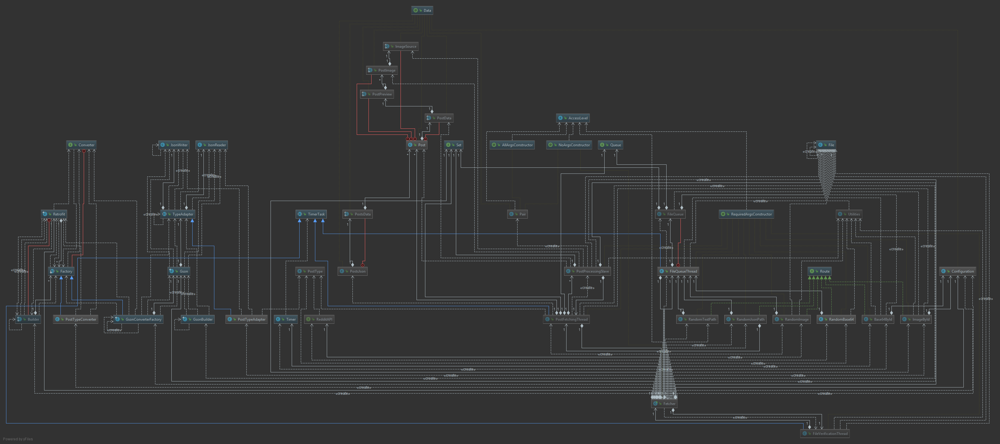

# Birb Fetcher
### From where?
Reddit. The host decides subreddits.

### What's the catch?
uhh, the fact it's written in Java, possibly?

May use an extreme amount of storage if not regulated externally is also one, I guess.

### How does it look right now?

(Recreated every minor or major commit, as long as it isn't a 
general WIP thing and it needs to be regenerated)